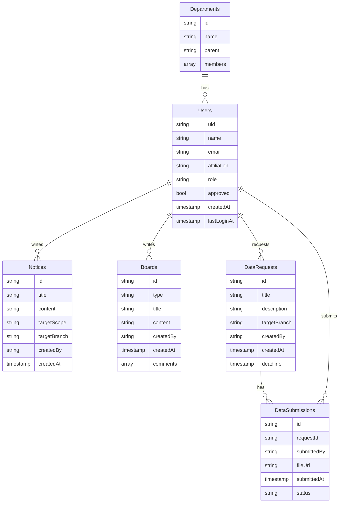

# 1단계: Firestore DB 설계

## 1.1 컬렉션/필드 구조

### Users
| 필드명         | 타입      | 설명                       |
|----------------|-----------|----------------------------|
| uid            | string    | Firebase Auth UID          |
| name           | string    | 이름                       |
| email          | string    | 이메일                     |
| affiliation    | string    | 소속(본사/지점명)          |
| role           | string    | main_admin/hq_admin/branch_admin/employee |
| approved       | bool      | 승인 여부                  |
| createdAt      | timestamp | 가입일                     |
| lastLoginAt    | timestamp | 최종 접속 시간             |

### Notices
| 필드명         | 타입      | 설명                       |
|----------------|-----------|----------------------------|
| id             | string    | 문서 ID                    |
| title          | string    | 제목                       |
| content        | string    | 내용                       |
| targetScope    | string    | all/branch                 |
| targetBranch   | string    | (branch일 때) 지점명        |
| createdBy      | string    | 작성자 uid                 |
| createdAt      | timestamp | 작성일                     |

### Boards (일반/익명)
| 필드명         | 타입      | 설명                       |
|----------------|-----------|----------------------------|
| id             | string    | 문서 ID                    |
| type           | string    | normal/anonymous           |
| title          | string    | 제목                       |
| content        | string    | 내용                       |
| createdBy      | string    | 작성자 uid                 |
| createdAt      | timestamp | 작성일                     |
| comments       | array     | 댓글(하위 컬렉션 가능)      |

### DataRequests
| 필드명         | 타입      | 설명                       |
|----------------|-----------|----------------------------|
| id             | string    | 문서 ID                    |
| title          | string    | 요청 제목                  |
| description    | string    | 요청 내용                  |
| targetBranch   | string    | 대상 지점                  |
| createdBy      | string    | 요청자 uid                 |
| createdAt      | timestamp | 요청일                     |
| deadline       | timestamp | 마감일                     |

### DataSubmissions
| 필드명         | 타입      | 설명                       |
|----------------|-----------|----------------------------|
| id             | string    | 문서 ID                    |
| requestId      | string    | DataRequest 참조           |
| submittedBy    | string    | 제출자 uid                 |
| fileUrl        | string    | Wasabi 파일 URL            |
| submittedAt    | timestamp | 제출일                     |
| status         | string    | 제출/미제출/지연 등        |

### Departments (회사 정보)
| 필드명         | 타입      | 설명                       |
|----------------|-----------|----------------------------|
| id             | string    | 부서 ID                    |
| name           | string    | 부서명                     |
| parent         | string    | 상위 부서 ID               |
| members        | array     | 소속 직원 uid 리스트        |

## 1.2 역할별 Firestore 접근 권한표

| 컬렉션         | main_admin | hq_admin | branch_admin | employee |
|----------------|:----------:|:--------:|:------------:|:--------:|
| Users          | CRUD       | R        | R            | R        |
| Notices        | CRUD       | CRUD     | CR           | R        |
| Boards         | CRUD       | CRUD     | CRUD         | CR       |
| DataRequests   | CRUD       | CRUD     | CR           | R        |
| DataSubmissions| R          | R        | R            | CR       |
| Departments    | CRUD       | R        | R            | R        |

- C: 생성(Create), R: 조회(Read), U: 수정(Update), D: 삭제(Delete)
- 승인되지 않은 사용자는 모든 컬렉션 접근 불가
- 익명 게시판: Firestore에는 작성자 UID 저장, UI에만 숨김

## 1.3 ERD(관계도)

